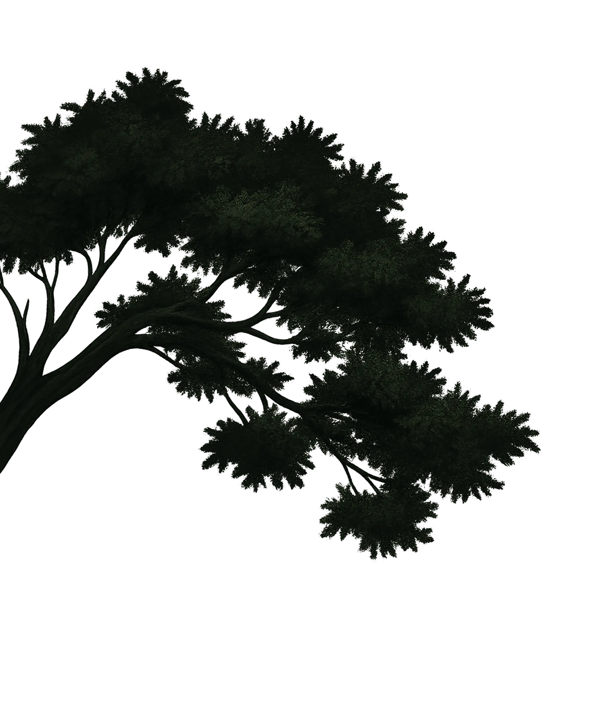
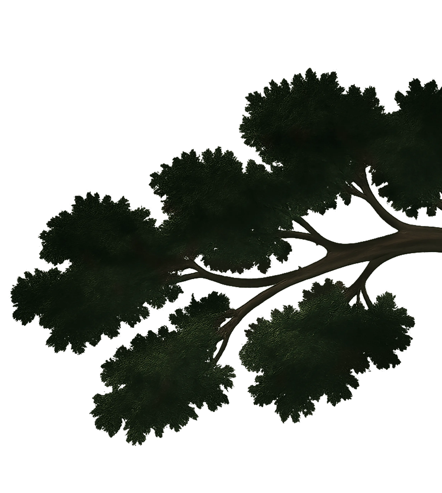
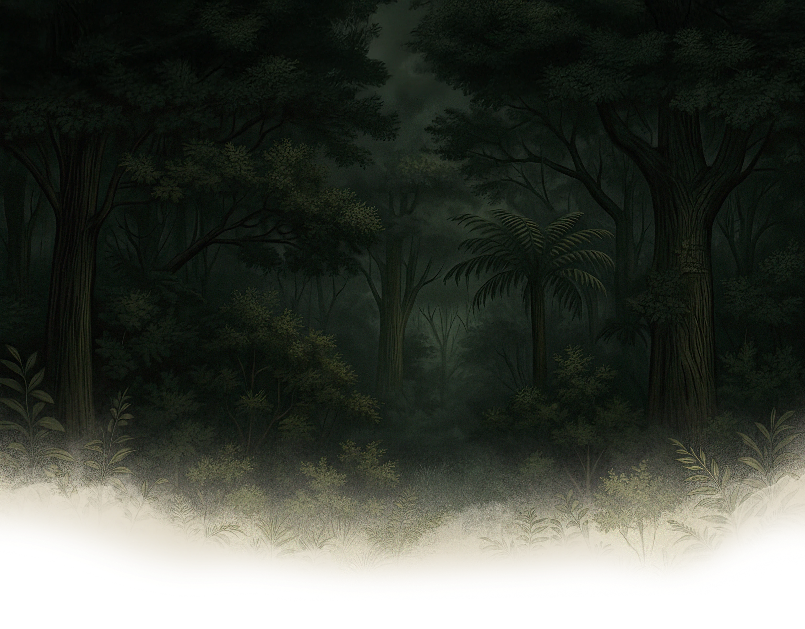

# Ironhill-section-rebuild/ — How It Works

A **scroll-driven hero with a noise-based dissolve overlay** powered by Three.js + a custom GLSL fragment shader, animated text reveal via GSAP `SplitText`, and smooth scrolling via Lenis. Two parallax "twig" images move at different rates as you scroll.

Files:
- `index.html` — minimal markup (one section, one canvas, one paragraph).
- `script.js` — the whole show: shaders, Three.js scene, scroll integration, animations.
- `index.scss` — imported by `script.js` (Vite-style import).

This project is **dense** for its size. It teaches: raw WebGL via Three.js, GLSL shaders, Lenis ↔ ScrollTrigger wiring, and word-by-word text reveal driven by `ScrollTrigger.onUpdate`.

---

## 1. Markup (`index.html`)

```html
<div data-anim-index class="index">
  <section class="hero">
    <div class="hero__twigs">
      
      
    </div>
    <div class="hero__row">
      
      <canvas class="hero-canvas"></canvas>
      <div class="hero__conteiner">
        <div class="hero__top">
          <h1>IRONHILL</h1>
          <p>Section rebuilt by Animmaster</p>
        </div>
        <div class="hero__content">
          <h2>There's a place not far from here the maps won't show, known to some as the Ironhill.</h2>
        </div>
      </div>
    </div>
  </section>
</div>

<script src="https://cdn.jsdelivr.net/npm/gsap@3.14.1/dist/gsap.min.js"></script>
<script src="https://cdn.jsdelivr.net/npm/gsap@3.14.1/dist/ScrollTrigger.min.js"></script>
<script src="script.js"></script>
```

**Note** the BEM-style classes (`hero__twig--left`). The GSAP+ScrollTrigger libraries load from a CDN; the main `script.js` is bundled separately (it `import`s things from npm so in dev it'd be served by Vite/Webpack).

---

## 2. The shaders (top of `script.js`)

```js
const vertexShader = `
  varying vec2 vUv;
  void main() {
    vUv = uv;
    gl_Position = projectionMatrix * modelViewMatrix * vec4(position, 1.0);
  }
`
```

**Breakdown** (vertex shader runs once per vertex):
- `varying vec2 vUv;` — a "varying" variable is interpolated across the triangle and passed to the fragment shader.
- `vUv = uv;` — `uv` is Three.js's built-in attribute (texture coords 0..1 across the geometry). Save it.
- `gl_Position = projectionMatrix * modelViewMatrix * vec4(position, 1.0);` — standard transform: take the vertex position (in object space), convert through model-view-projection matrices into clip space. **This is the canonical Three.js vertex shader.** Memorize it.

```js
const fragmentShader = `
  uniform float uProgress;
  uniform vec2 uResolution;
  uniform vec3 uColor;
  uniform float uSpread;
  varying vec2 vUv;

  float Hash(vec2 p) {
    vec3 p2 = vec3(p.xy, 1.0);
    return fract(sin(dot(p2, vec3(37.1, 61.7, 12.4))) * 3758.5453123);
  }

  float noise(in vec2 p) {
    vec2 i = floor(p);
    vec2 f = fract(p);
    f *= f * (3.0 - 2.0 * f);
    return mix(
      mix(Hash(i + vec2(0.0, 0.0)), Hash(i + vec2(1.0, 0.0)), f.x),
      mix(Hash(i + vec2(0.0, 1.0)), Hash(i + vec2(1.0, 1.0)), f.x),
      f.y
    );
  }

  float fbm(vec2 p) {
    float v = 0.0;
    v += noise(p * 1.0) * 0.5;
    v += noise(p * 2.0) * 0.25;
    v += noise(p * 4.0) * 0.125;
    return v;
  }

  void main() {
    vec2 uv = vUv;
    float aspect = uResolution.x / uResolution.y;
    vec2 centeredUv = (uv - 0.5) * vec2(aspect, 1.0);
    
    float dissolveEdge = uv.y - uProgress * 1.2;
    float noiseValue = fbm(centeredUv * 15.0);
    float d = dissolveEdge + noiseValue * uSpread;
    
    float pixelSize = 1.0 / uResolution.y;
    float alpha = 1.0 - smoothstep(-pixelSize, pixelSize, d);
    
    gl_FragColor = vec4(uColor, alpha);
  }
`
```

**Breakdown** (fragment shader runs once per pixel):
- `uniform float uProgress;` — controlled from JS (the scroll progress).
- `uniform vec2 uResolution;` — canvas size in px.
- `uniform vec3 uColor;` — overlay color as RGB 0..1.
- `uniform float uSpread;` — how noisy the dissolve edge is.
- `Hash(p)` — pseudo-random number from a 2D coordinate. The classic `fract(sin(dot(...)) * big_number)` trick.
- `noise(p)` — smooth value noise built by bilinearly interpolating four `Hash` samples per cell. The `3.0 - 2.0 * f` ramp is Perlin's "smoothstep" curve.
- `fbm(p)` — fractal Brownian motion: sum noise at multiple frequencies (1x, 2x, 4x) at decreasing amplitudes (0.5, 0.25, 0.125). Looks like organic clouds.
- In `main()`:
  - `vec2 centeredUv = (uv - 0.5) * vec2(aspect, 1.0);` — center UVs around 0 and squish so the noise pattern doesn't look stretched in non-square aspects.
  - `dissolveEdge = uv.y - uProgress * 1.2;` — a horizontal line that moves down as `uProgress` grows. (`* 1.2` so it can fully clear off the screen at progress=1).
  - `d = dissolveEdge + noiseValue * uSpread;` — perturb that edge by the noise. Now it's a wavy, organic threshold.
  - `pixelSize = 1.0 / uResolution.y;` — one pixel in UV units.
  - `alpha = 1.0 - smoothstep(-pixelSize, pixelSize, d);` — `smoothstep` is anti-aliased step. Below the edge → alpha = 1 (opaque). Above → alpha = 0 (transparent). The `pixelSize` width gives a one-pixel-wide soft transition (no aliasing).
  - `gl_FragColor = vec4(uColor, alpha);` — output color (uniform) with computed alpha.

**Intuition**: as `uProgress` goes 0 → 1, a fluffy noise-edged boundary sweeps up the screen revealing what's behind. Used as an "overlay reveal" on top of the hero image.

---

## 3. Lenis + ScrollTrigger glue

```js
import Lenis from 'lenis'
import gsap from 'gsap'
import { ScrollTrigger } from 'gsap/ScrollTrigger'
import { SplitText } from 'gsap/SplitText'
gsap.registerPlugin(ScrollTrigger, SplitText)

const lenis = new Lenis()
function raf(time) {
  lenis.raf(time)
  ScrollTrigger.update()
  requestAnimationFrame(raf)
}
requestAnimationFrame(raf)
lenis.on('scroll', ScrollTrigger.update)
```

**Line-by-line**:
- `new Lenis()` — creates a smooth-scroll instance that hijacks wheel events and animates `window.scrollTo` smoothly.
- `raf(time)` — your animation frame callback. It:
  - `lenis.raf(time)` advances Lenis's internal interpolation by one frame.
  - `ScrollTrigger.update()` tells GSAP to re-evaluate trigger progress.
  - `requestAnimationFrame(raf)` schedules the next call.
- `lenis.on('scroll', ScrollTrigger.update)` — also force an update on every Lenis scroll event, even outside the rAF loop.

**Why this matters**: without this wiring, ScrollTrigger and Lenis would disagree on scroll position and your animations would jitter.

---

## 4. Setting up Three.js with a single fullscreen quad

```js
const canvas = document.querySelector('.hero-canvas')
const hero = document.querySelector('.hero')

const scene = new THREE.Scene()
const camera = new THREE.OrthographicCamera(-1, 1, 1, -1, 0, 1)
const renderer = new THREE.WebGLRenderer({
  canvas,
  alpha: true,        // transparent background
  antialias: false,
})
```

**Why orthographic?** Because the whole point is to render a flat 2D quad covering the canvas. Perspective would distort it. Orthographic just maps `[-1,1] × [-1,1]` of object space directly to the screen.

```js
function resize() {
  const width = hero.offsetWidth
  const height = hero.offsetHeight
  renderer.setSize(width, height)
  renderer.setPixelRatio(Math.min(window.devicePixelRatio, 2))
}
resize()
window.addEventListener('resize', resize)
```

**Breakdown**:
- `renderer.setSize(w, h)` — sets canvas pixel dimensions and CSS dimensions.
- `renderer.setPixelRatio(Math.min(devicePixelRatio, 2))` — render at the device pixel density, but cap at 2x. On Retina displays this is 2x; on 3x phones we'd cap to 2x to save GPU.

---

## 5. The mesh

```js
const rgb = hexToRgb(CONFIG.color)
const geometry = new THREE.PlaneGeometry(2, 2)
const material = new THREE.ShaderMaterial({
  vertexShader,
  fragmentShader,
  uniforms: {
    uProgress: { value: 0 },
    uResolution: {
      value: new THREE.Vector2(hero.offsetWidth, hero.offsetHeight),
    },
    uColor: { value: new THREE.Vector3(rgb.r, rgb.g, rgb.b) },
    uSpread: { value: CONFIG.spread },
  },
  transparent: true,
})

const mesh = new THREE.Mesh(geometry, material)
scene.add(mesh)
```

- `new THREE.PlaneGeometry(2, 2)` — a 2×2 plane in XY. Because the camera is orthographic with bounds `[-1,1]`, this exactly fills the view.
- `ShaderMaterial({ vertexShader, fragmentShader, uniforms })` — we wrote both shaders. Uniforms expose JS-side handles we'll update later.
- `transparent: true` — required so the `alpha` we compute in the fragment shader actually shows through.

---

## 6. The render loop + scroll-to-uniform mapping

```js
let scrollProgress = 0

function animate() {
  material.uniforms.uProgress.value = scrollProgress
  renderer.render(scene, camera)
  requestAnimationFrame(animate)
}
animate()

lenis.on('scroll', ({ scroll }) => {
  const heroHeight = hero.offsetHeight
  const windowHeight = window.innerHeight
  const maxScroll = heroHeight - windowHeight
  scrollProgress = Math.min((scroll / maxScroll) * CONFIG.speed, 1.1)
})
```

**Breakdown**:
- `material.uniforms.uProgress.value = scrollProgress` — every frame, push the latest scroll progress into the shader.
- `renderer.render(scene, camera)` — actually draw the scene.
- `lenis.on('scroll', ({ scroll }) => …)` — Lenis fires this every smoothed scroll tick.
  - `maxScroll = heroHeight - windowHeight` — how far you'd scroll if the hero filled the screen height-by-height.
  - `scrollProgress = scroll / maxScroll * speed` — normalize. The `* CONFIG.speed` (1) tunes speed. Capped at `1.1` to let the dissolve fully complete.

---

## 7. Resize-aware uniforms

```js
window.addEventListener('resize', () => {
  material.uniforms.uResolution.value.set(hero.offsetWidth, hero.offsetHeight)
})
```

Re-write the `uResolution` uniform on resize so the noise stays at consistent screen scale.

---

## 8. SplitText word-by-word reveal driven by ScrollTrigger

```js
const heroH2 = document.querySelector('.hero__content h2')
const split = new SplitText(heroH2, { type: 'words' })
const words = split.words

gsap.set(words, { opacity: 0 })

ScrollTrigger.create({
  trigger: '.hero__content',
  start: 'top 25%',
  end: 'bottom 100%',
  onUpdate: self => {
    const progress = self.progress
    const totalWords = words.length

    words.forEach((word, index) => {
      const wordProgress = index / totalWords
      const nextWordProgress = (index + 1) / totalWords

      let opacity = 0.1

      if (progress >= nextWordProgress) {
        opacity = 1
      } else if (progress >= wordProgress) {
        const fadeProgress =
          (progress - wordProgress) / (nextWordProgress - wordProgress)
        opacity = fadeProgress
      }

      gsap.to(word, {
        opacity: opacity,
        duration: 0.1,
        overwrite: true,
      })
    })
  },
})
```

**What it does**: each word in the heading fades in only when scroll progress passes its slice of the trigger range. The 1st word at `progress=0..1/N`, the 2nd at `progress=1/N..2/N`, and so on. Words you haven't reached yet sit at `opacity: 0.1` (faint hint).

**Line-by-line**:
- `new SplitText(heroH2, { type: 'words' })` — wraps each word in a `<div>` for individual targeting.
- `gsap.set(words, { opacity: 0 })` — set initial opacity instantly (no animation).
- `ScrollTrigger.create({ ..., onUpdate: self => { ... } })` — `onUpdate` fires whenever the trigger progress changes (i.e. every frame of scroll while the section is in view).
- `self.progress` — a number 0..1 representing how far through the start→end range we are.
- For each word, compute its slice (`wordProgress` → `nextWordProgress`).
- `opacity = (progress - wordProgress) / (nextWordProgress - wordProgress)` — linear interpolation 0..1 within this word's slice.
- `gsap.to(word, { opacity, duration: 0.1, overwrite: true })`:
  - `duration: 0.1` — quick interpolation so updates feel responsive.
  - `overwrite: true` — kill any in-progress tween for this word so we don't queue up dozens.

**Why not `gsap.set`?** Setting directly with no duration would create instant snaps as scroll progresses. Using `gsap.to` with a tiny duration adds a tiny easing for smooth perceptual blending.

---

## 9. Twig parallax (`hero__twig--left`, `hero__twig--right`)

```js
gsap.to('.hero__twig--left', {
  y: -2000,
  ease: 'none',
  scrollTrigger: {
    trigger: '.hero',
    start: 'top top',
    end: 'bottom top',
    scrub: true,
  },
})

gsap.to('.hero__twig--right', {
  y: -3500,
  ease: 'none',
  scrollTrigger: {
    trigger: '.hero',
    start: 'top top',
    end: 'bottom top',
    scrub: true,
  },
})
```

**Breakdown**:
- Each twig is translated up `-2000` or `-3500px` as scroll progresses.
- `ease: 'none'` is essential with `scrub` — non-linear easing on scrubbed timelines feels wrong (the user's input is linear, so the response should be linear).
- Different `y` distances give different parallax speeds. Right twig moves faster (`-3500` > `-2000`) so the two layers separate visually.

---

## 10. hexToRgb helper

```js
function hexToRgb(hex) {
  const result = /^#?([a-f\d]{2})([a-f\d]{2})([a-f\d]{2})$/i.exec(hex)
  return result
    ? {
        r: parseInt(result[1], 16) / 255,
        g: parseInt(result[2], 16) / 255,
        b: parseInt(result[3], 16) / 255,
      }
    : { r: 0.89, g: 0.89, b: 0.89 }
}
```

Regex captures 3 hex pairs, `parseInt(x, 16)` decodes hex, divide by 255 to get 0..1 (shader-friendly).

**Memorize this**: any time you pass colors to a shader, you'll need this exact function.

---

## 11. Build this from scratch

A 60-line "noise dissolve overlay" you could write in an interview:

```js
import * as THREE from 'three'

const scene = new THREE.Scene()
const camera = new THREE.OrthographicCamera(-1, 1, 1, -1, 0, 1)
const renderer = new THREE.WebGLRenderer({ alpha: true, antialias: false })
renderer.setSize(innerWidth, innerHeight)
document.body.appendChild(renderer.domElement)

const material = new THREE.ShaderMaterial({
  transparent: true,
  uniforms: { uProgress: { value: 0 }, uColor: { value: new THREE.Color('#fff') } },
  vertexShader: `varying vec2 vUv; void main(){vUv=uv;gl_Position=vec4(position,1.0);}`,
  fragmentShader: `
    uniform float uProgress; uniform vec3 uColor; varying vec2 vUv;
    float rand(vec2 p){return fract(sin(dot(p,vec2(37.1,61.7)))*3758.5);}
    void main(){
      float edge = vUv.y - uProgress;
      float n = rand(floor(vUv*30.0));
      float alpha = 1.0 - smoothstep(-0.01,0.01,edge + n*0.2);
      gl_FragColor = vec4(uColor, alpha);
    }`,
})
const mesh = new THREE.Mesh(new THREE.PlaneGeometry(2,2), material)
scene.add(mesh)

function render(){
  material.uniforms.uProgress.value = Math.min(window.scrollY / (innerHeight*2), 1)
  renderer.render(scene, camera)
  requestAnimationFrame(render)
}
render()
```

That's the **whole** idea. The Ironhill version adds proper noise (fbm), proper Lenis wiring, and a SplitText reveal — but the core is exactly 30 lines.

---

## 12. What this folder teaches you

- A complete Three.js scene with **custom shaders**.
- The canonical vertex shader (`gl_Position = projectionMatrix * modelViewMatrix * vec4(position, 1.0)`).
- Value noise and FBM in GLSL.
- `smoothstep` for anti-aliased edges.
- Hooking Lenis + ScrollTrigger + GSAP together correctly.
- Driving uniforms from scroll progress.
- Word-by-word reveal via `SplitText` + `ScrollTrigger.onUpdate`.
- Differential parallax speeds for layered visuals.

This is **the** single most "wow"-able project in the repo for an interview. If you can explain how the noise dissolve works on a whiteboard, you've impressed any interviewer who knows what shaders are.
